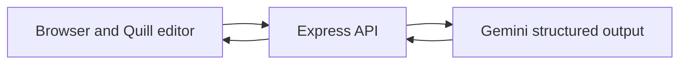

# Prober.ai

Prober.ai is a reflection-first AI tutor for argumentative writing. Instead of immediately rewriting a student's draft, it identifies a small number of reasoning gaps, asks targeted questions, and waits for the student to respond before unlocking a focused revision suggestion.

The project was created for the NY EdTech Hackathon and received second place.

## What makes it different

The core learning loop is intentionally gated:

1. The student writes or imports a draft.
2. A selected reviewer persona asks focused, open-ended questions.
3. The student explains or defends the reasoning in their own words.
4. Only then does Prober.ai unlock a limited revision suggestion and a transferable writing tip.

This design preserves productive cognitive effort while still giving the student concrete support at the moment it is useful.

## Product features

- Two reviewer perspectives:
  - **Reviewer 2** probes claims, warrants, counterarguments, and scope.
  - **Confused Reader** identifies missing definitions and unexplained reasoning steps.
- Structured feedback generated against explicit JSON schemas.
- Reflection-gated revision suggestions.
- Exact excerpt verification before in-editor highlighting.
- Quill 2 rich-text editor with text and Markdown import.
- Tabs and cards views that preserve entered reflections and unlock progress.
- Printable session export for students and instructors.
- No-key demo with pre-loaded feedback and suggestions.
- Optional, consent-gated study instrumentation and JSONL export.
- Keyboard-accessible tabs, reduced-motion support, responsive layout, and theme persistence.

## Architecture



The browser submits the draft and selected persona to `POST /challenge`. Express keeps application instructions separate from student text, requests schema-constrained JSON from Gemini, validates every required field, and returns only the normalized response. After the student writes a reflection, `POST /unlock` receives the full draft, challenge context, and reflection, then returns one focused suggestion and one general writing tip.

The current implementation uses the maintained `@google/genai` SDK. The default model is `gemini-3.7-flash`, and `GEMINI_MODEL` can override it without changing code.

## Quick start

Requirements:

- Node.js 20 or newer
- npm

From the repository root:

```bash
npm install
npm start
```

Open `http://localhost:3000`.

You can then choose one of two API-key modes:

- **Browser key:** leave `GEMINI_API_KEY` unset and enter a key in the app. By default the key is kept in `sessionStorage` for the current tab. Persistent storage is opt-in.
- **Server key:** copy the example environment file and set a deployment-level key.

```bash
cp essay-tutor/.env.example essay-tutor/.env
```

```dotenv
GEMINI_API_KEY=your_key_here
GEMINI_MODEL=gemini-3.7-flash
```

The landing page and `/demo` are public. `/app` requests a browser key only when the server does not already have one configured.

## Commands

All commands can be run from the repository root.

| Command | Purpose |
| --- | --- |
| `npm start` | Start the Express app on port 3000 |
| `npm run check` | Syntax-check server, browser, and utility JavaScript |
| `npm test` | Run the Node test suite |
| `npm run export:study` | Convert local study JSONL logs to CSV |

## Configuration

| Variable | Default | Description |
| --- | --- | --- |
| `PORT` | `3000` | Local HTTP port |
| `GEMINI_API_KEY` | unset | Optional server-side Gemini key |
| `GEMINI_MODEL` | `gemini-3.7-flash` | Compatible Gemini model ID |
| `AI_RATE_LIMIT_MAX` | `30` | AI requests allowed per client and window |
| `AI_RATE_LIMIT_WINDOW_MS` | `60000` | In-memory AI rate-limit window |
| `STUDY_LOGGING_ENABLED` | development only | Enables research-data endpoints |
| `STUDY_LOG_DIR` | `study-logs` | Directory for JSONL research logs |
| `TRUST_PROXY` | `false` | Trust one reverse-proxy hop when explicitly enabled |

Never commit `.env`, study logs, exported participant data, or API keys.

## API overview

| Route | Method | Purpose |
| --- | --- | --- |
| `/health` | `GET` | Liveness, version, and active model |
| `/api/config` | `GET` | Non-secret client configuration |
| `/challenge` | `POST` | Generate persona-specific questions |
| `/unlock` | `POST` | Generate a suggestion after reflection |
| `/study/session` | `POST` | Start a consent-confirmed study session |
| `/study/event` | `POST` | Record a study interaction event |
| `/study/draft` | `POST` | Record a versioned study draft |

Browser-provided API keys are sent in the `X-Gemini-Api-Key` request header. The legacy request-body field remains accepted by the server for compatibility, but new clients should use the header.

## Reliability and safety controls

- Request bodies and essay, reflection, question, and response fields have explicit size limits.
- Student text is passed as untrusted data, separate from system instructions.
- Gemini responses are constrained with endpoint-specific JSON schemas and validated again on the server.
- Model quotations are used for highlighting only when they occur verbatim in the submitted essay.
- AI output is escaped before the browser renders its limited Markdown subset.
- API and key-management responses use `Cache-Control: no-store`.
- Security headers and per-request IDs are added by Express.
- A lightweight per-process rate limit protects the AI endpoints; production platforms can add a shared gateway-level limiter.
- Provider errors are mapped to safe, actionable HTTP responses without returning raw stack details.

## Research logging

Study logging is off in production unless `STUDY_LOGGING_ENABLED=true` is set. The interface requires explicit participant-consent confirmation before it starts a study session. When enabled, the app can capture:

- session metadata and assigned condition;
- editor and reviewer interaction events;
- versioned draft snapshots;
- generated challenges;
- student reflections and unlocked suggestions.

Local logs are written as JSONL under `essay-tutor/study-logs/` unless `STUDY_LOG_DIR` is changed. This filesystem strategy is intended for local or stateful research deployments. Serverless filesystems such as Vercel are not durable research storage; use an approved persistent data store before running a real study there.

## Project layout

| Path | Contents |
| --- | --- |
| `.github/workflows/ci.yml` | Clean-install, syntax, and test workflow |
| `docs/technical-report/` | Hackathon paper, review, presentation, and compiled PDF |
| `essay-tutor/public/` | Browser UI, auth helper, themes, and demo |
| `essay-tutor/samples/` | Importable example essays |
| `essay-tutor/scripts/` | Study-log export utility |
| `essay-tutor/test/` | Network-independent server tests |
| `essay-tutor/pedagogy_guide.md` | Prompt guidance for inquiry-only feedback |
| `essay-tutor/server.js` | Express routes, Gemini integration, and study logging |
| `essay-tutor/vercel.json` | Serverless packaging and routing |
| `package.json` | Root workspace commands |
| `package-lock.json` | Reproducible dependency graph |

`node_modules` is intentionally excluded from version control. `package-lock.json` is the reproducible dependency source for local development and CI.

## Deployment

`essay-tutor/vercel.json` packages the Express handler, frontend assets, sample essays, and pedagogical guide. For a server-key deployment, configure `GEMINI_API_KEY` and `GEMINI_MODEL` in the hosting environment. Keep study logging disabled unless the deployment includes approved, durable storage and the required research governance.

## Technical report

The original hackathon technical report and presentation are in [`docs/technical-report`](docs/technical-report). They document the competition build and may therefore name the model and SDK used at that time. The application code and this README describe the current implementation.

The engineering findings, completed fixes, verification evidence, and remaining limitations for this branch are recorded in [`docs/REPOSITORY_AUDIT.md`](docs/REPOSITORY_AUDIT.md).

## Team

- Shiyao Wei
- Yuanyiyi Zhou
- Ran Bi
