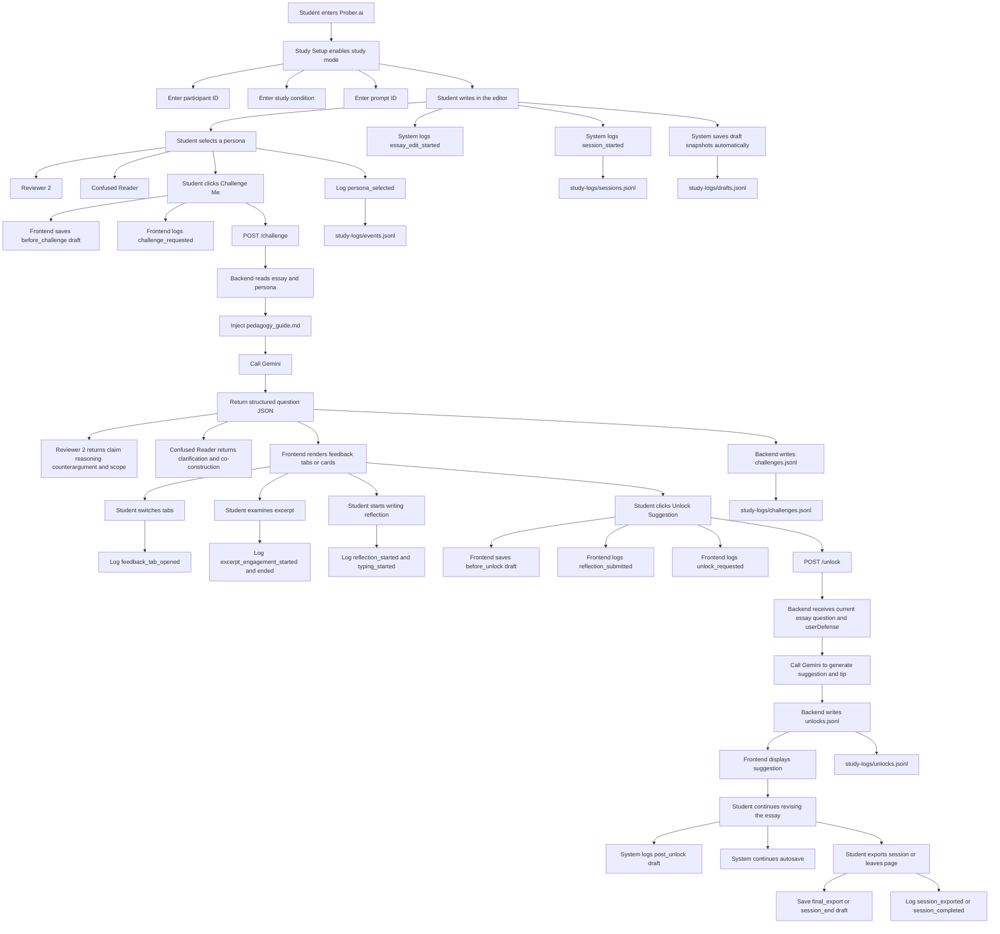
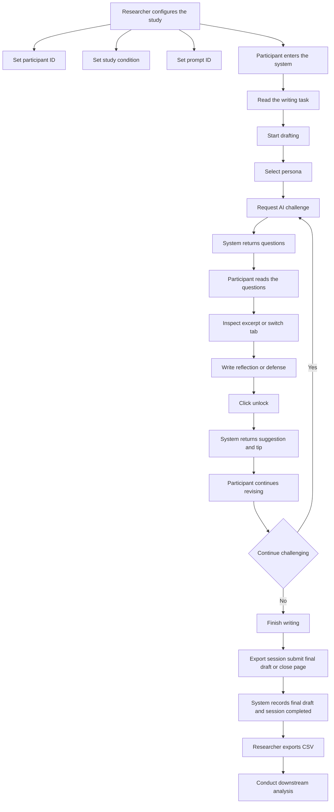
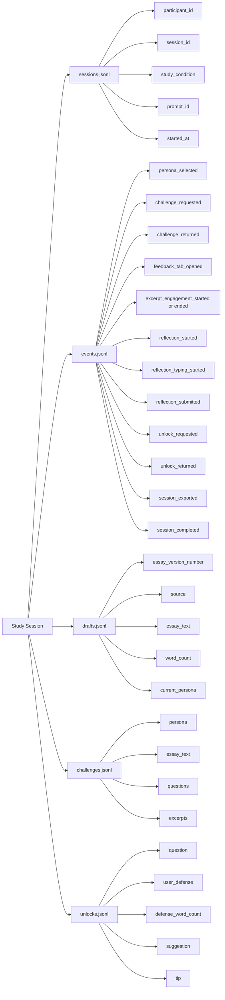

# Study Diagrams

## Figure 1: System Function and Data Flow

```mermaid
flowchart TD
    A[Student enters Prober.ai] --> B[Study Setup enables study mode]
    B --> B1[Enter participant ID]
    B --> B2[Enter study condition]
    B --> B3[Enter prompt ID]

    B --> C[Student writes in the editor]
    C --> C1[System logs session_started]
    C --> C2[System logs essay_edit_started]
    C --> C3[System saves draft snapshots automatically]

    C --> D[Student selects a persona]
    D --> D1[Reviewer 2]
    D --> D2[Confused Reader]
    D --> D3[Log persona_selected]

    D --> E[Student clicks Challenge Me]
    E --> E1[Frontend saves before_challenge draft]
    E --> E2[Frontend logs challenge_requested]
    E --> F[POST /challenge]

    F --> G[Backend reads essay and persona]
    G --> H[Inject pedagogy_guide.md]
    H --> I[Call Gemini]
    I --> J[Return structured question JSON]

    J --> J1[Reviewer 2 returns claim reasoning counterargument and scope]
    J --> J2[Confused Reader returns clarification and co-construction]

    J --> K[Backend writes challenges.jsonl]
    J --> L[Frontend renders feedback tabs or cards]

    L --> L1[Student switches tabs]
    L --> L2[Student examines excerpt]
    L --> L3[Student starts writing reflection]

    L1 --> M1[Log feedback_tab_opened]
    L2 --> M2[Log excerpt_engagement_started and ended]
    L3 --> M3[Log reflection_started and typing_started]

    L --> N[Student clicks Unlock Suggestion]
    N --> N1[Frontend saves before_unlock draft]
    N --> N2[Frontend logs reflection_submitted]
    N --> N3[Frontend logs unlock_requested]
    N --> O[POST /unlock]

    O --> P[Backend receives current essay question and userDefense]
    P --> Q[Call Gemini to generate suggestion and tip]
    Q --> R[Backend writes unlocks.jsonl]
    R --> S[Frontend displays suggestion]

    S --> T[Student continues revising the essay]
    T --> T1[System logs post_unlock draft]
    T --> T2[System continues autosave]

    T --> U[Student exports session or leaves page]
    U --> U1[Save final_export or session_end draft]
    U --> U2[Log session_exported or session_completed]

    C1 --> V[study-logs/sessions.jsonl]
    C3 --> W[study-logs/drafts.jsonl]
    D3 --> X[study-logs/events.jsonl]
    K --> Y[study-logs/challenges.jsonl]
    R --> Z[study-logs/unlocks.jsonl]
```

## Figure 2: Experimental Workflow

```mermaid
flowchart TD
    A[Researcher configures the study] --> A1[Set participant ID]
    A --> A2[Set study condition]
    A --> A3[Set prompt ID]

    A --> B[Participant enters the system]
    B --> C[Read the writing task]
    C --> D[Start drafting]

    D --> E[Select persona]
    E --> F[Request AI challenge]
    F --> G[System returns questions]

    G --> H[Participant reads the questions]
    H --> I[Inspect excerpt or switch tab]
    I --> J[Write reflection or defense]
    J --> K[Click unlock]

    K --> L[System returns suggestion and tip]
    L --> M[Participant continues revising]

    M --> N{Continue challenging}
    N -->|Yes| F
    N -->|No| O[Finish writing]

    O --> P[Export session submit final draft or close page]
    P --> Q[System records final draft and session completed]
    Q --> R[Researcher exports CSV]
    R --> S[Conduct downstream analysis]
```

## Figure 3: Research Data Structure

```mermaid
flowchart LR
    A[Study Session] --> B[sessions.jsonl]
    A --> C[events.jsonl]
    A --> D[drafts.jsonl]
    A --> E[challenges.jsonl]
    A --> F[unlocks.jsonl]

    B --> B1[participant_id]
    B --> B2[session_id]
    B --> B3[study_condition]
    B --> B4[prompt_id]
    B --> B5[started_at]

    C --> C1[persona_selected]
    C --> C2[challenge_requested]
    C --> C3[challenge_returned]
    C --> C4[feedback_tab_opened]
    C --> C5[excerpt_engagement_started or ended]
    C --> C6[reflection_started]
    C --> C7[reflection_typing_started]
    C --> C8[reflection_submitted]
    C --> C9[unlock_requested]
    C --> C10[unlock_returned]
    C --> C11[session_exported]
    C --> C12[session_completed]

    D --> D1[essay_version_number]
    D --> D2[source]
    D --> D3[essay_text]
    D --> D4[word_count]
    D --> D5[current_persona]

    E --> E1[persona]
    E --> E2[essay_text]
    E --> E3[questions]
    E --> E4[excerpts]

    F --> F1[question]
    F --> F2[user_defense]
    F --> F3[defense_word_count]
    F --> F4[suggestion]
    F --> F5[tip]
```
