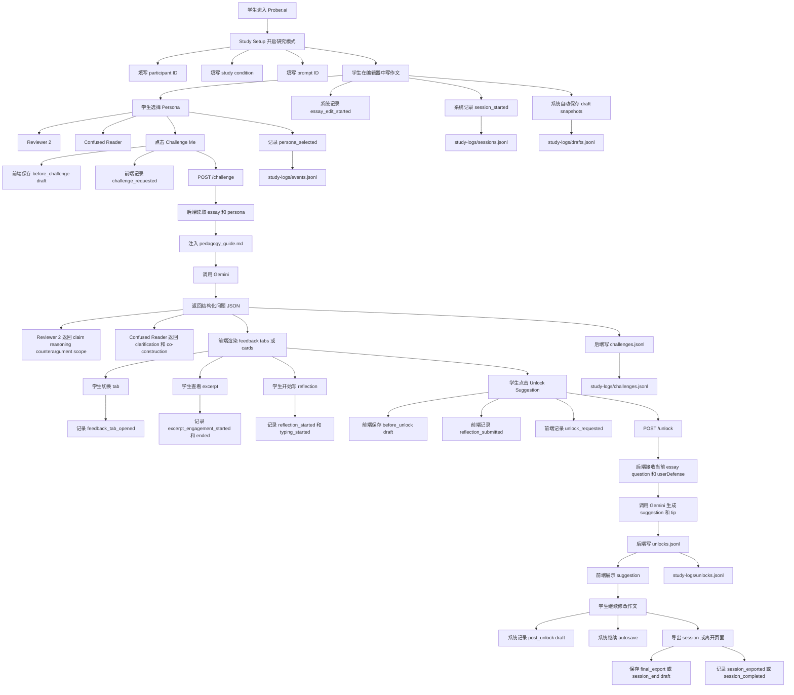
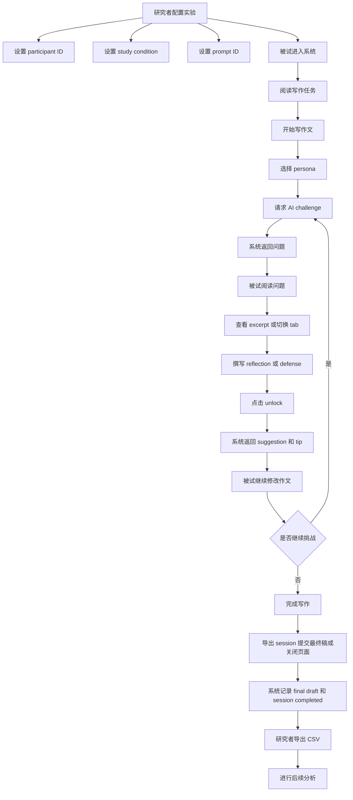
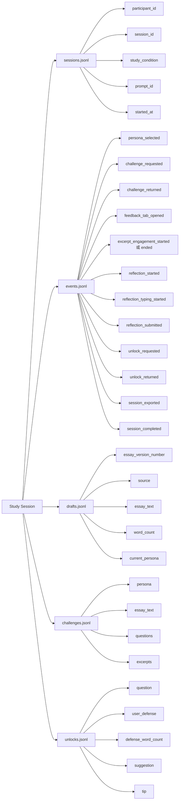

# Study Diagrams

## 图 1：系统功能与数据流

```mermaid
flowchart TD
    A[学生进入 Prober.ai] --> B[Study Setup 开启研究模式]
    B --> B1[填写 participant ID]
    B --> B2[填写 study condition]
    B --> B3[填写 prompt ID]

    B --> C[学生在编辑器中写作文]
    C --> C1[系统记录 session_started]
    C --> C2[系统记录 essay_edit_started]
    C --> C3[系统自动保存 draft snapshots]

    C --> D[学生选择 Persona]
    D --> D1[Reviewer 2]
    D --> D2[Confused Reader]
    D --> D3[记录 persona_selected]

    D --> E[点击 Challenge Me]
    E --> E1[前端保存 before_challenge draft]
    E --> E2[前端记录 challenge_requested]
    E --> F[POST /challenge]

    F --> G[后端读取 essay 和 persona]
    G --> H[注入 pedagogy_guide.md]
    H --> I[调用 Gemini]
    I --> J[返回结构化问题 JSON]

    J --> J1[Reviewer 2 返回 claim reasoning counterargument scope]
    J --> J2[Confused Reader 返回 clarification 和 co-construction]

    J --> K[后端写 challenges.jsonl]
    J --> L[前端渲染 feedback tabs 或 cards]

    L --> L1[学生切换 tab]
    L --> L2[学生查看 excerpt]
    L --> L3[学生开始写 reflection]

    L1 --> M1[记录 feedback_tab_opened]
    L2 --> M2[记录 excerpt_engagement_started 和 ended]
    L3 --> M3[记录 reflection_started 和 typing_started]

    L --> N[学生点击 Unlock Suggestion]
    N --> N1[前端保存 before_unlock draft]
    N --> N2[前端记录 reflection_submitted]
    N --> N3[前端记录 unlock_requested]
    N --> O[POST /unlock]

    O --> P[后端接收当前 essay question 和 userDefense]
    P --> Q[调用 Gemini 生成 suggestion 和 tip]
    Q --> R[后端写 unlocks.jsonl]
    R --> S[前端展示 suggestion]

    S --> T[学生继续修改作文]
    T --> T1[系统记录 post_unlock draft]
    T --> T2[系统继续 autosave]

    T --> U[导出 session 或离开页面]
    U --> U1[保存 final_export 或 session_end draft]
    U --> U2[记录 session_exported 或 session_completed]

    C1 --> V[study-logs/sessions.jsonl]
    C3 --> W[study-logs/drafts.jsonl]
    D3 --> X[study-logs/events.jsonl]
    K --> Y[study-logs/challenges.jsonl]
    R --> Z[study-logs/unlocks.jsonl]
```

## 图 2：实验流程图

```mermaid
flowchart TD
    A[研究者配置实验] --> A1[设置 participant ID]
    A --> A2[设置 study condition]
    A --> A3[设置 prompt ID]

    A --> B[被试进入系统]
    B --> C[阅读写作任务]
    C --> D[开始写作文]

    D --> E[选择 persona]
    E --> F[请求 AI challenge]
    F --> G[系统返回问题]

    G --> H[被试阅读问题]
    H --> I[查看 excerpt 或切换 tab]
    I --> J[撰写 reflection 或 defense]
    J --> K[点击 unlock]

    K --> L[系统返回 suggestion 和 tip]
    L --> M[被试继续修改作文]

    M --> N{是否继续挑战}
    N -->|是| F
    N -->|否| O[完成写作]

    O --> P[导出 session 提交最终稿或关闭页面]
    P --> Q[系统记录 final draft 和 session completed]
    Q --> R[研究者导出 CSV]
    R --> S[进行后续分析]
```

## 图 3：研究数据结构图

```mermaid
flowchart LR
    A[Study Session] --> B[sessions.jsonl]
    A --> C[events.jsonl]
    A --> D[drafts.jsonl]
    A --> E[challenges.jsonl]
    A --> F[unlocks.jsonl]

    B --> B1[participant_id]
    B --> B2[session_id]
    B --> B3[study_condition]
    B --> B4[prompt_id]
    B --> B5[started_at]

    C --> C1[persona_selected]
    C --> C2[challenge_requested]
    C --> C3[challenge_returned]
    C --> C4[feedback_tab_opened]
    C --> C5[excerpt_engagement_started 或 ended]
    C --> C6[reflection_started]
    C --> C7[reflection_typing_started]
    C --> C8[reflection_submitted]
    C --> C9[unlock_requested]
    C --> C10[unlock_returned]
    C --> C11[session_exported]
    C --> C12[session_completed]

    D --> D1[essay_version_number]
    D --> D2[source]
    D --> D3[essay_text]
    D --> D4[word_count]
    D --> D5[current_persona]

    E --> E1[persona]
    E --> E2[essay_text]
    E --> E3[questions]
    E --> E4[excerpts]

    F --> F1[question]
    F --> F2[user_defense]
    F --> F3[defense_word_count]
    F --> F4[suggestion]
    F --> F5[tip]
```
